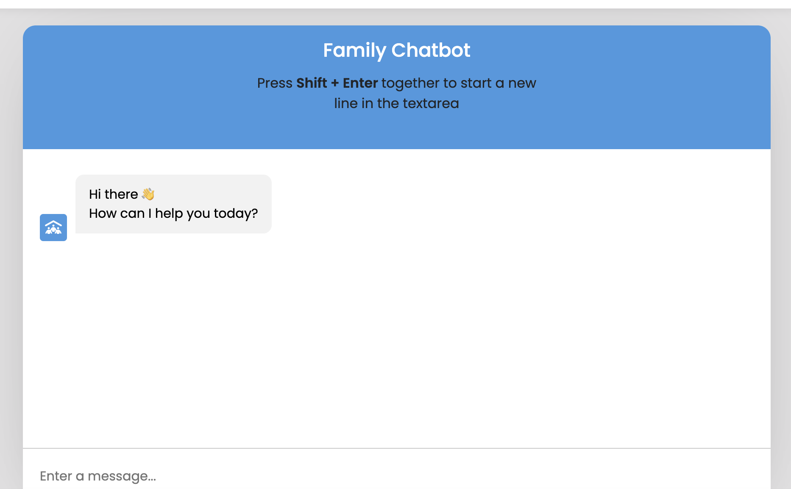

# FamilyTech  <a id="top"/>

 

## Introduction

This website was created for Code Institute, May Hackathon - themed: A Family Hackathon.<br>

The main objective of this Haackathon was to build a site/app that could provide support for IT issues that different members of the family generally have and how we could help them with these issues.

That would be achieved through showing guides for the users to fix their IT issues.

Live site: [FamilyTech](https://familytech-3d93c509ed81.herokuapp.com/)

## Table of Contents
- [FamilyTech](#familytech)
    - [Introduction](#introduction)
    - [Table of Contents](#table-of-contents)
    - [Overview](#overview)
- [Ux - User Experience](#ux---user-experience)
    - [Colour Scheme](#colour-scheme)
    - [Typography](#typography)
- [Project Planning](#project-planning)
    - [Strategy](#strategy)
    - [Agile Methodologies](#agile-methodologies)
    - [Users](#users)
    - [Wireframes](#wireframes)
    - [Imagery](#imagery)
    - [Features](#features)
- [Technologies Used](#technologies-used)
    - [Languages and Technologies](#languages-and-technologies)
    - [Libraries](#libraries)
    - [Tools and Programs](#tools-and-programs)
- [Deployment](#deployment)
    - [Connecting to GigHub](#connecting-to-github)
      - [Within Codespace](#within-the-codespace)
      - [Procfile](#procfile)
      - [Deployment static files](#deployment-with-static-files)
      - [Commiting changes](#committing-changes)
    - [Heroku Deployment](#heroku-deployment)
    - [Clone Project](#clone-project)
    - [Fork Project](#fork-project)
    - [Django Project Setup](#django-project-setup)
- [Bugs to fix](#bugs-to-fix)
- [AI Implementation and Orchestration](#ai-implementaion-and-orchestration)
    - [Code Generation](#code-generation)
    - [Debugging](#debugging)
    - [Code Optimization](#code-optimisation)
    - [Impact on Workflow](#impact-on-workflow)
- [Testing](#testing)
    - [HTML Validation](#html-validation)
    - [CSS Validation](#css-validation)
    - [Lighthouse Audit](#lighthouse-audit)
    - [Manual Testing](#manual-testing)
- [Future Features](#future-features)
- [Chatbot Feature](#chatbot-feature)
- [Credits](#credits)
    - [Acknowledgments](#acknowledgements)
    - [Owner Details](#owner-details)


[Back to top](#top)

# Overview
FamilyTech is a simple site that provides information about how to do some tasks on mobiles devices and laptops or computers.<br>

It also has a chat-bot function in case the user doesn't finds the information he needs.<br>

It aims to be an interactive and responsive site in different devices.<br>

The site goal is to help the user overcome the strugle with different issues while trying to open an app, sending a message or adding a new contact.<br>

## UX - User Experience
For this site we opted to use smooth colours that could help the user to relax and be confident with the solution provided.<br>

Some of the features available
  - Access to posts with guides for different devices
  - Chat-bot for extra help, in case no help is available on the site

[Back to top](#top)

## Colour Scheme

#ffffff - White
#4b5563 - Bright Grey
#4299e1 - Tufts Blue
#2d3748 - Japanese Indigo
#4b5563 - Independence

 - [Color Palette](https://colorkit.co/color-palette-generator/ffffff-4b5563-4299e1-2d3748-cac8c8-e9e7e7-f4BAF2E9f3f3/)

Names checked with [color-name](https://www.color-name.com/hex/4b5563)


## Typography
Fonts used for this website were:

  - [Roboto](https://fonts.google.com/specimen/Roboto)
  - [sans-serif](https://fonts.google.com/?query=sans+serif&categoryFilters=Sans+Serif:%2FSans%2F*)
  
  
[Back to top](#top)

# Project Planning

Initial idea for the chat was to create help guides for tasks done at home, not just with technology, but also with household appliances and where to find different things.<br>

After discussing this, the group got to the conclusion that the hackathon theme was more related to tech issues and problems that different members of the family from different ages can find while using their devices, and we should focus more on this area, and add the household appliances, if possible, once the electronic devices (eg: mobile phone, latpop) are well covered and we are happy with the site working and responsiveness.<br>

With this done, different areas of the site (back-end, front-end, colours, etc, where picked by different members of the team.<br>

On the first day the repository and project were created with all members added with admin rights.<br>

Heroku deployment done successfully on the third day.<br>

The team kept working on improving the site features and fixing errors.<br>

## Strategy

  - Simple and appealing layout and colors
  - User-friendly platform
  - Menus easy to locate and select
  - Consistent UX design throughout different platforms
  - Allow for future improvements and addition of new features

## Agile Methodologies
FamilyTech was the first hackathon for one of our members and a come back experience for the rest of the group.<br>

In the begining sounded a bit tricky to check which role different members could get, but with communication within the team we were able to get everyone to work in different areas of the website, and slowly start building the project.<br>

We did our best to have 2 huddles per day, with one after lunch and another later in the day to discuss the site progress and what needed to be changed, improved and what was done well.<br>

Good and frequent (as possible) communication helped to keep the project on track, with extra huddles, as needed to check inidividual issues and try to solve them.<br>

Issues and features can be seen on [GitHub Project Board](https://github.com/users/Carlos-n21/projects/19).<br>

[Back to top](#top)

### Users

Persona 1: Tech-Savvy Student

    Name: Alex Chen

    Age: 20

    Occupation: Computer Science Student

    Devices Used: Laptop (primary), Smartphone (for quick lookups)

    Tech Skill Level: Intermediate to Advanced

    Goals:

        Find quick solutions for coding bugs or software installation issues

        Access reliable technical instructions between classes or while commuting

    Pain Points:

        Frustrated with vague or outdated solutions on forums

        Needs mobile-friendly content for use on the go

    Behaviors:

        Searches Google or Reddit first, but prefers visual step-by-step guides

        Frequently bookmarks or saves useful guides to read later

Persona 2: Non-Tech-Savvy Professional

    Name: Linda Martinez

    Age: 42

    Occupation: Office Manager at a small business

    Devices Used: Work Laptop (primary), Smartphone (occasionally)

    Tech Skill Level: Beginner

    Goals:

        Fix common issues like printer setup, Wi-Fi problems, or email errors

        Follow simple, jargon-free instructions

    Pain Points:

        Intimidated by overly technical explanations

        Needs clear visuals or videos to follow along

    Behaviors:

        Relies on step-by-step guides or video tutorials

        Often searches “[problem] + how to fix” on Google

Persona 3: Freelance IT Support Technician

    Name: Rajiv Patel

    Age: 33

    Occupation: Freelance IT Support Specialist

    Devices Used: Smartphone (on-site visits), Laptop (at home/office)

    Tech Skill Level: Advancedphones

    Goals:

        Quickly access troubleshooting steps while assisting clients on-site

        Stay updated with latest fixes and tech tools

    Pain Points:

        Time-sensitive troubleshooting—needs concise and accurate content

        Frustrated by guides that aren’t mobile-optimized

    Behaviors:

        Skims guides for relevant commands or screenshots

        Prefers content with clear structure, quick reference sections, or downloadable PDFs


[Back to top](#top)

### Wireframes
Initial wireframes - desktop view:


Initial wireframes - mobile view:


[Back to top](#top)

### Imagery
Image used on the homepage:

- [Elderly using technology](https://cdn.shopify.com/s/files/1/0656/3289/5229/files/Elderly_Using_Technology_Stock_Imagery_TapTec.png?v=1695582894)

[Back to top](#top)

## Features
Some of the features that can be seen on the website are:

- [Homepage](https://familytech-3d93c509ed81.herokuapp.com/) with information about the site
- [Technical Issues](https://familytech-3d93c509ed81.herokuapp.com/technicalissues/) page with different devices that users might have with guides for common issues and troubleshooting
- [Chatbot](https://familytech-3d93c509ed81.herokuapp.com/chatbot/) for issues not present on the site
- [Booksmarks](https://familytech-3d93c509ed81.herokuapp.com/profile/bookmarks/) below the profile, after the user logs in, where the user can see is saved guides
- Ability to save guides as bookmarks, by clicking on the [star icon](https://familytech-3d93c509ed81.herokuapp.com/technicalissues/mobile/), after being logged in.

[Back to top](#top)

## Chatbot Feature



### Overview
The FamilyTech Chatbot offers instant help for IT issues that users may not find in the site’s guides. It uses OpenAI’s GPT-3.5 Turbo to provide intelligent responses in natural language.

- This youtube tutorial was used to help develop the chatbot - [Build AI Chatbot in HTML CSS & JavaScript | AI Chatbot Tutorial in JavaScript](https://www.youtube.com/watch?v=B21G6tUI4L0&pp=0gcJCdgAo7VqN5tD)

### How to Use
- Open the 'Chatbot' section from the navigation menu
- Type your question in the chat box and press Enter
- Use Shift+Enter to insert a new line in the textarea, but this is only for screen sizes above 800px in width.

### Key Features
- Natural language Q&A for family tech problems
- Powered by OpenAI (GPT-3.5 Turbo) and connected to OpenAI through an API Key.
- Integrated in the site for real-time help

### Error Handling
  - If the chatbot for whatever reason can't return a response then the chatbot will reply with "Oops! Something went wrong."

  

  - If their is a network connection issue then the chatbot will reply with "Oops! Something went wrong. Please try again" with a red background.

  


[Back to top](#top)

## Technologies Used
### Languages and Technologies
  - HTML
  - CSS
  - JavaScript
  - Python
  - Git
  - GitHub
  - VS Code
  - Django (v5.2.1)
  - Heroku
  - Pillow (v11.2.1)
  - Whitenoise (v6.9.0)
  - Gunicorn (v23.0.0)
  - Python-dotenv (v1.1.0)

### Libraries
  - Django v5.2.1
  - Pillow v11.2.1
  - Whitenoise v6.9.0
  - Gunicorn v23.0.0
  - Sqlparse v0.5.3
  - Python-dotenv v1.1.0
  - Pydantic v2.11.4
  - Pydantic Core v2.33.2
  - Annotated-types v0.7.0
  - Asgiref v3.8.1
  - Typing-inspection v0.4.0
  - Tqdm v4.67.1
  - Google Fonts
  - Jiter v0.9.0

### Tools and Programs
  - Balsamiq wireframe
  - MSCopilot AI
  - VS-Code Copilot
  - ChatGPT
  - OpenAI
  - Django Admin
  - Heroku

[Back to top](#top)

## Deployment

### Connecting to GitHub
To begin this project from scratch, you must first create a new GitHub repository using the Code Institute's Template. This template provides the relevant tools to get you started. To use this template:

  - Log in to GitHub or create a new account.<br>
  - Navigate to the above CI Full Template.<br>
  - Click 'Use this template' -> 'Create a new repository'.<br>
  - Choose a new repository name and click 'Create repository from template'.<br>
  - In your new repository space, click the purple CodeAnywhere (if this is your IDE of choice) button to generate a new workspace, or green one if you are using gitpod.<br>

### Within the codespace

#### Procfile

+ Install the gunicorn python package and freeze to requirements.txt.

+ Create a file called 'Procfile' and add the following command ``` web: gunicorn familytech.wsgi ```.

#### Deployment with static files

+ The whitenoise python package was installed and added to requirements.txt

+ In settings.py add whitenoise middleware to middleware and add a static root path to 'staticfiles'.
  - ```'whitenoise.middleware.WhiteNoiseMiddleware',```

+ Enter the command ``` python3 manage.py collectstatic ``` into the terminal.

+ Create the file 'runtime.txt' and add a supported runtime from [supported runtimes](https://devcenter.heroku.com/articles/python-support#specifying-a-python-version).
+  in Settings.py make sure that that Allowed Hosts and CSRF_TRUSTED_ORIGINS are set so they include the Heroku app
  ````
      ALLOWED_HOSTS = [
        'localhost',
        '127.0.0.1',
        '.gitpod.io',
        **'.herokuapp.com'**
    ]
    
    CSRF_TRUSTED_ORIGINS = [
        "https://*.gitpod.io",  
        **"https://*.herokuapp.com"**  
    ]

  ````
+ #### Debug
    + Set debug to False on settings.py

[Back to top](#top)

#### Committing changes

+ git add. , commit and push the changes with and appropriate commit message such as "prepare project for deployment"

### Heroku Deployment

This project was deployed using Heroku.

#### On Heroku

+ Log into Heroku
+ Select 'Create New App' from your dashboard, choose an app name and select the appropriate region.

+ Then In 'Config Vars' enter KEY:VALUE pairs for the app to run successfully. The KEY:VALUE pairs that you will need are your:<br>

  - OPENAI_API_KEY:<"your openai api key">
  - SECRET_KEY:<"your secret key">
+ Select 'Deploy' on the navigation menu and in the 'Deployment method' section select Github, enter your repository and select 'Connect'.
+ At the bottom of the page in the Manual deploy section click 'manual deploy' and once it has finished loading select 'open app'.

[Back to top](#top)

#### Extra notes on Deployment
- If you are wanting to deploy the projet without any static files, you will need to have the KEY:VALUE pair <strong>DISABLE_COLLECTSTATIC: 1</strong> in your Heroku Config Vars which should be removed once your project has static files.
- There is the option to select 'Resources' on the navigation menu and enable Eco Dynos on Heroku.
---

### Clone project
A local clone of this repository can be made on GitHub. Please follow the below steps:

  - Navigate to GitHub and log in.
  - Kids Art Repository can be found at this location.
  - Above the repository file section, locate the 'Code' button.
  - Click on this button and choose your clone method from HTTPS, SSH or GitHub CLI, copy the URL to your clipboard by clicking the 'Copy' button.
  - Open your Git Bash Terminal.
  - Change the current working directory to the location you want the cloned directory to be made.
  - Type git clone and paste in the copied URL from step 4.
  - Press 'Enter' for the local clone to be created.
  - Using the pip3 install -r requirements.txt command, the dependencies and libraries needed for FreeFido will be installed.
  - Set up your env.py file and from the above steps for Cloudinary and NeonSQL, gather the Cloudinary API key and the Neon SQL url for additon to your code.
  - Ensure that your env.py file is placed in your .gitignore file and follow the remaining steps in the above Django Project Setup section before pushing your code to GitHub.

### Fork Project
A copy of the original repository can be made through GitHub. Please follow the below steps to fork this repository:

  - Navigate to GitHub and log in.
  - Once logged in, navigate to this repository using this link Eventia Repository.
  - Above the repository file section and to the top, right ofTrue the page is the 'Fork' button, click on this to make a fork of this repository.
  - You should now have access to a forked copy of this repository in your Github account.
  - Follow the above Django Project Steps if you wish to work on the project.


[Back to top](#top)

### Bugs to fix
- Login sometimes not wroking after a user as logged out and wants to go back
- Layout can present in a different way on medium screens

## AI Implementaion and Orchestration
### Code Generation
Copilot and ChatGPT were used to help generate code for the website in different ways.<br>
Either by accepting suggestions on VS-Code or asking for code recommendations.

### Debugging
For debugging, AI's mentioned above where used to help fix errors.<br>
Using AI extension on VS-Code also allowed to check quick mistakes signaled by AI and to quickly correct them.

### Code Optimisation
Using AI, can make debugging faster and with recommendations while writting code, helps to create new code faster.<br>
The developer still needs to quickly check if the code is correct and do changes as needed.<br>

### Impact on Workflow
Overall, when well used, AI can reduce the time needed to code what we need.<br>

[Back to top](#top)

## Testing

### HTML Validation
Used [W3C Markup Validation Service](https://validator.w3.org/#validate_by_input) to test the HTML on all webpages and updated as needed. No errors found after fixing as can be seen on the examples bellow.
<details>
  
  
  
</details>

[Back to top](#top)

### CSS Validation

Used [W3C CSS Validation Service](https://jigsaw.w3.org/css-validator/#validate_by_input) to test CSS style and no errors found.

  
  

### Lighthouse Audit

Used Chrome Dev Tools Lighthouse to audit the site for response time and accessibility, as you can see onm the examples bellow.<br>
<details>
  
  
  
  
  
  
  
  
</details>

[Back to top](#top)

### Manual Testing
Website manually tested on the following devices/browsers for responsiveness:
  - Google Chrome
  - Mozilla Firefox
  - Opera
  - Vivaldi••••••••••
  - Samsung Galaxy A40
  - Google Pixel 8

[Back to top](#top)

## Future Features
- Add more interacivity to the page
- Possibly, add the feature to have a•••••••••• message pop-up on all the pages
- Include a way for AI to save searches made by users for technical issues not present on the site
- Chat between different users to help each other
- Add a commnunity forum where users can add extra guides sugestions for admins or volunteers to add to the site


### Acknowledgements
This was a good experience, with members communicating and laiaising to fix bugs and help each other.<br>
At times a bit confusing and slower, but with huddles and discussions, project went forward.

### Owner Details
This website was created by student of Code Institute.<br>

  - [Jarvey](https://github.com/OJarvey)
  - [Tamanna](https://github.com/farhatamannaislam)
  - [Tumelo](https://github.com/tumelo-maja)
  - [Tumelo](https://github.com/Cam-4587)
  - [Carlos](https://github.com/Carlos-n21)

[Back to top](#top)
